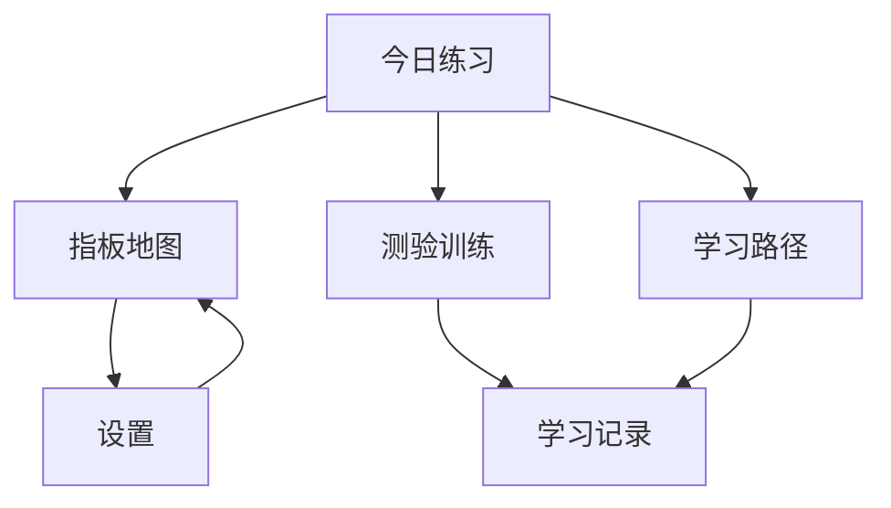
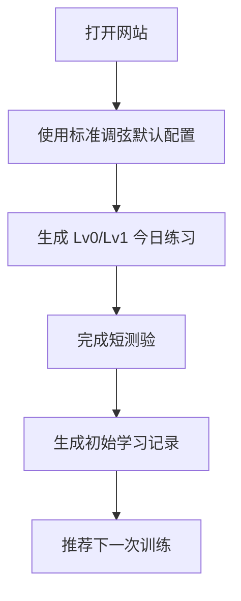
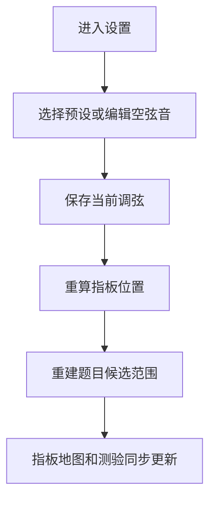
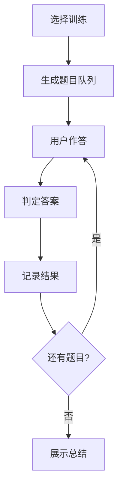

# 吉他指板音学习网站产品设计文档

版本：v1.0  
日期：2026-07-07  
定位：自用优先、可公开部署的纯前端吉他指板音学习系统  
部署目标：GitHub Pages  

> **文档状态说明（2026-07-13）：** 本文前 21 章保留最初的完整产品愿景，不再作为当前版本的逐项验收清单。当前已实现范围以第 22 章“实现与扩展备忘”、`2026-07-11-guitar-fretboard-daily-history-and-glossary-design.md` 和实际测试为准；未落地的学习路径、独立学习记录页、自定义调弦编辑、数据导入导出继续作为延期项，不得描述为 v0.2.0 已支持。

## 1. 项目概述

本项目是一个面向个人学习的吉他指板音训练网站。它不是单纯的“指板音查询器”，而是一个围绕“认识、定位、回忆、测验、复习、应用”建立闭环的学习系统。

第一版以标准 6 弦吉他为核心对象，支持 0-24 品和每根弦自定义空弦音。网站不依赖后端，不做账号系统，不做云同步，通过浏览器本地存储保存学习进度、错题、复习计划和配置。用户可将其部署到已有 GitHub Pages，并在电脑和手机浏览器中使用。

## 2. 设计目标

### 2.1 核心目标

1. 帮助用户逐步认识并记忆吉他指板上的音名。
2. 通过可视化指板模拟真实吉他把位，建立“弦、品、音名、音高”的空间关系。
3. 通过测验和错题复习检验学习效果，而不是只让用户被动查看答案。
4. 通过难度分级和每日训练建议，让用户能循序渐进地记忆。
5. 适配碎片时间，用户打开网站即可开始 3-10 分钟训练。
6. 保持纯前端架构，便于 GitHub Pages 部署。
7. 支持点击任意把位播放对应音高。

### 2.2 非目标

第一版不做以下内容：

1. 用户注册、登录、云同步。
2. 后端服务、数据库服务、服务端任务调度。
3. 麦克风识别真实吉他演奏。
4. 复杂 DAW 或效果器功能。
5. 多乐器通用训练器。
6. 7 弦、8 弦、贝斯、乌克丽丽等可变弦数界面。
7. 乐谱编辑、伴奏生成、完整曲谱学习。

底层数据模型可以保留未来扩展空间，但第一版界面固定为 6 弦吉他。

## 3. 用户与使用场景

### 3.1 目标用户

主要用户是正在学习吉他指板音的个人学习者，具备以下特征：

1. 已知道吉他有 6 根弦和品格，但对全指板音名不熟。
2. 希望把零散记忆变成稳定反应。
3. 希望在碎片时间练习，而不是每次都打开复杂软件。
4. 需要可视化指板辅助理解。
5. 可能使用不同调弦，例如 Drop D、半音降弦、DADGAD。

### 3.2 典型场景

| 场景 | 用户目标 | 网站响应 |
|---|---|---|
| 通勤或午休 | 练 3 分钟 | 首页直接展示今日短练 |
| 正式练琴前 | 热身指板音 | 快速测验 20 题 |
| 学某个调 | 查看调内音分布 | 指板地图高亮调内音和音级 |
| 改用 Drop D | 重新计算音名 | 调弦切换后全站题库同步变化 |
| 发现某些位置总错 | 针对弱点复习 | 错题权重和热力图提示弱区 |

## 4. 产品原则

### 4.1 主动回忆优先

学习体验应鼓励用户先回忆再查看答案。展示答案的功能必须存在，但首页和学习路径不应把“看完整指板音名”作为主要行为。

### 4.2 小步快练

默认训练单元应控制在 3-10 分钟内。每次练习结束都给出清晰反馈：正确率、平均反应时间、错题位置、建议复习范围。

### 4.3 空间关系优先

指板学习不是只背单点，而是理解同音、八度、音程、把位和调内音的空间关系。系统应在练习中逐步引入这些关系。

### 4.4 静态部署友好

所有功能必须能在纯前端运行。数据保存在 localStorage 或 IndexedDB。用户可导出和导入数据，以弥补无云同步的限制。

### 4.5 配置影响全局

当前调弦、品格范围、显示方式等配置会影响指板地图、测验题库、学习路径和音频播放。系统必须保证配置变更后各模块结果一致。

## 5. 信息架构



### 5.1 一级页面

| 页面 | 作用 | 第一版优先级 |
|---|---|---|
| 今日练习 | 进入网站后的默认页，展示当天建议训练 | 必做 |
| 指板地图 | 自由查看、筛选、点击播放 | 必做 |
| 测验训练 | 各类随机题和专项训练 | 必做 |
| 学习路径 | 分阶段学习建议和解锁进度 | 必做 |
| 学习记录 | 热力图、错题、历史统计 | 必做 |
| 设置 | 调弦、显示、音频、本地数据 | 必做 |

## 6. 页面设计

### 6.1 今日练习页

今日练习页是默认入口。页面目标是减少决策成本，让用户打开即可练。

#### 主要内容

1. 今日训练卡片：展示推荐训练时长、训练范围和题型。
2. 开始按钮：一键进入今日训练。
3. 今日目标：例如“复习 F、Bb、7-10 品弱区”。
4. 近期进度：展示连续练习天数、最近正确率、平均反应时间。
5. 快速入口：3 分钟、5 分钟、10 分钟三种训练包。

#### 训练包规则

| 训练包 | 题量 | 内容 |
|---|---:|---|
| 3 分钟 | 15-20 题 | 以错题和高频复习为主 |
| 5 分钟 | 25-35 题 | 错题、旧题、新题混合 |
| 10 分钟 | 50-70 题 | 包含专项题和综合题 |

#### 空状态

首次使用时没有历史数据，今日练习默认生成：

1. 空弦音认知。
2. 0-5 品自然音。
3. 标准调弦下的基础找音题。

### 6.2 指板地图页

指板地图是自由探索与可视化页面。

#### 指板要求

1. 固定 6 弦布局。
2. 支持 0-24 品。
3. 支持横向滚动或缩放，移动端不能挤压到无法点击。
4. 每个弦品交点是可点击按钮。
5. 点击后播放对应音高，并显示详细信息。

#### 显示模式

| 模式 | 表现 |
|---|---|
| 全部音名 | 每个品格显示 C、C#、D 等音名 |
| 自然音 | 只显示 A-G，自然音以外淡化 |
| 指定音 | 只高亮目标音，例如所有 C |
| 调内音 | 高亮当前调的所有音 |
| 音级 | 显示 1、2、3、4、5、6、7 |
| 隐藏答案 | 只显示品格，点击后显示结果 |

#### 过滤条件

1. 品格范围：0-5、0-12、0-24、自定义。
2. 弦范围：全部、单弦、相邻弦组。
3. 音名范围：自然音、升降音、全部。
4. 调性：C、G、D、A、E、F、Bb 等常用调。
5. 音阶：大调、小调、五声音阶。

### 6.3 测验训练页

测验训练页负责主动回忆。

#### 测验入口

| 入口 | 说明 |
|---|---|
| 今日测验 | 按学习算法生成 |
| 找音训练 | 给音名，点击指板位置 |
| 认音训练 | 给位置，回答音名 |
| 单弦训练 | 限定一根弦 |
| 把位训练 | 限定一段品格 |
| 调内音训练 | 围绕调和音级 |
| 综合考试 | 混合题型、限时、计分 |

#### 基础题型

1. 找所有目标音：例如“找出所有 C”。
2. 找限定范围目标音：例如“在 5-8 品找出所有 G”。
3. 识别位置音名：例如“4 弦 7 品是什么音？”。
4. 单弦推导题：例如“5 弦 5 品是什么音？”。
5. 八度题：给定一个位置，找同音八度位置。
6. 音程题：从根音出发找大三度、纯五度、小七度。
7. 调内音题：在某调中找 1、3、5 或非调内音。
8. 限时速度题：固定时长内尽可能正确作答。

#### 答题反馈

每题反馈包含：

1. 正确或错误。
2. 正确答案位置。
3. 当前音高播放按钮。
4. 必要时显示推导提示，例如“5 弦空弦 A，向上 5 个半音为 D”。

#### 结束反馈

每组训练结束后展示：

1. 总题数、正确数、正确率。
2. 平均反应时间。
3. 最容易错的音名。
4. 最容易错的弦或品格范围。
5. 下一次建议复习内容。

### 6.4 学习路径页

学习路径负责指导用户从基础到应用。

#### 阶段设计

| 阶段 | 名称 | 范围 | 达标标准 |
|---|---|---|---|
| Lv0 | 空弦音 | 6 根空弦 | 正确率 95%，平均 1 秒内 |
| Lv1 | 第一把位自然音 | 0-5 品 A-G | 正确率 90% |
| Lv2 | 单音全指板 | 0-12 品指定音 | 每个自然音正确率 85% |
| Lv3 | 八度关系 | 常见八度形状 | 正确率 85% |
| Lv4 | 单弦记忆 | 每根弦 0-12 品 | 单弦正确率 85% |
| Lv5 | 把位记忆 | 5-8、7-10 等范围 | 把位正确率 85% |
| Lv6 | 调内音 | 常用调和音级 | 正确率 80% |
| Lv7 | 综合应用 | 音程、调性、速度题 | 综合正确率 80% |

#### 解锁策略

第一版不做强制锁定。用户可以自由进入任何阶段，但系统会标记推荐顺序和当前建议阶段。

### 6.5 学习记录页

学习记录页展示长期变化。

#### 统计维度

1. 按音名统计：C、C#、D 等正确率。
2. 按弦统计：1-6 弦正确率。
3. 按品格统计：0-24 品正确率。
4. 按题型统计：找音、认音、音程、调内音等。
5. 按日期统计：每日练习时长、题数、正确率。

#### 指板热力图

指板热力图使用颜色表示熟练度：

| 状态 | 颜色含义 |
|---|---|
| 熟练 | 正确率高、反应快 |
| 一般 | 正确率尚可但反应慢 |
| 薄弱 | 错误多或长期未复习 |
| 未练 | 没有足够数据 |

### 6.6 设置页

设置页集中管理全局配置。

#### 调弦设置

第一版固定 6 弦，但每根弦可改空弦音。

| 弦 | 标准调弦默认 |
|---|---|
| 6 弦 | E2 |
| 5 弦 | A2 |
| 4 弦 | D3 |
| 3 弦 | G3 |
| 2 弦 | B3 |
| 1 弦 | E4 |

预设：

1. Standard：E2 A2 D3 G3 B3 E4。
2. Drop D：D2 A2 D3 G3 B3 E4。
3. Half Step Down：Eb2 Ab2 Db3 Gb3 Bb3 Eb4。
4. DADGAD：D2 A2 D3 G3 A3 D4。
5. Custom：用户手动设置。

#### 其他设置

1. 默认品格范围：0-12 或 0-24。
2. 音名显示：英文音名、固定唱名、简谱音级。
3. 升降号偏好：升号优先、降号优先、按调性显示。
4. 音频设置：音量、波形、音长。
5. 数据管理：导出、导入、清空学习记录。

## 7. 指板计算设计

### 7.1 音高模型

系统使用十二平均律半音序列：

```text
C C# D D# E F F# G G# A A# B
```

内部统一使用半音编号计算，显示时再转换为音名。

### 7.2 弦品计算

每个位置的音高由空弦音和品格数决定：

```text
positionPitch = openStringPitch + fretNumber
```

每个位置的音名由音高编号对 12 取模得到：

```text
noteIndex = positionPitch % 12
```

每个位置的频率可由 MIDI 音高公式计算：

```text
frequency = 440 * 2 ^ ((midiNumber - 69) / 12)
```

### 7.3 数据结构示例

```ts
type NoteName =
  | "C" | "C#" | "D" | "D#" | "E" | "F"
  | "F#" | "G" | "G#" | "A" | "A#" | "B";

type StringConfig = {
  stringNumber: 1 | 2 | 3 | 4 | 5 | 6;
  displayName: string;
  openNote: string;
  midiNumber: number;
};

type FretboardProfile = {
  id: string;
  name: string;
  fretCount: 24;
  strings: StringConfig[];
};

type FretPosition = {
  stringNumber: number;
  fretNumber: number;
  noteName: NoteName;
  enharmonicName?: string;
  midiNumber: number;
  frequency: number;
};
```

## 8. 调性与音阶设计

### 8.1 支持范围

第一版支持：

1. 大调。
2. 自然小调。
3. 大调五声音阶。
4. 小调五声音阶。

### 8.2 音级显示

在调内音模式下，每个音显示为音级：

| 音级 | 含义 |
|---|---|
| 1 | 主音 |
| 2 | 二级音 |
| 3 | 三级音 |
| 4 | 四级音 |
| 5 | 五级音 |
| 6 | 六级音 |
| 7 | 七级音 |

五声音阶只显示该音阶内的音级，非调内音淡化或隐藏。

### 8.3 升降号显示策略

内部计算只使用 12 个半音编号。显示时根据用户设置决定：

1. 升号优先：C#、D#、F#、G#、A#。
2. 降号优先：Db、Eb、Gb、Ab、Bb。
3. 按调性显示：例如 F 大调显示 Bb，而不是 A#。

第一版至少实现升号优先和降号优先；按调性显示可作为增强项。

## 9. 音频设计

### 9.1 音频方案

第一版采用 Web Audio API 生成音高，不依赖音频文件。默认使用简单波形播放，保证部署轻量。

| 方案 | 优点 | 缺点 | 第一版选择 |
|---|---|---|---|
| Web Audio 生成 | 无资源文件、加载快、易部署 | 音色不真实 | 是 |
| 吉他采样文件 | 音色真实 | 文件多、加载重 | 否 |
| 合成器音色库 | 音色较好 | 实现复杂 | 否 |

### 9.2 播放行为

1. 点击指板位置时播放对应频率。
2. 测验答题后可自动播放正确答案。
3. 用户可关闭自动播放。
4. 每个音默认播放 0.4-0.8 秒。
5. 连续点击时应停止上一个音或快速衰减，避免声音叠加混乱。

### 9.3 浏览器限制

部分浏览器要求用户交互后才能启动音频上下文。因此音频初始化应发生在首次点击或按下“启用声音”按钮时。

## 10. 学习算法设计

### 10.1 记忆对象

系统记录的最小学习对象不是单纯音名，而是一个带上下文的技能标签。

示例：

| 技能标签 | 含义 |
|---|---|
| note:C | 目标音 C |
| string:5 | 第 5 弦 |
| fretRange:5-8 | 5-8 品范围 |
| position:5:3 | 5 弦 3 品 |
| quiz:identify-note | 认音题 |
| scale:C-major | C 大调 |

一道题可以绑定多个技能标签。用户答错后，相关标签都会被降低熟练度。

### 10.2 熟练度评分

每个技能维护以下字段：

```ts
type SkillState = {
  skillId: string;
  attempts: number;
  correct: number;
  wrong: number;
  accuracy: number;
  avgResponseMs: number;
  lastPracticedAt: string;
  strength: number;
  dueAt: string;
};
```

`strength` 表示当前掌握程度，可由正确率、反应时间、最近错误和间隔天数综合计算。

### 10.3 每日训练生成

每日训练由三类题组成：

| 类型 | 默认占比 | 说明 |
|---|---:|---|
| 到期复习 | 50% | 根据 dueAt 选择 |
| 薄弱强化 | 30% | 根据错误和低熟练度选择 |
| 新内容 | 20% | 根据学习路径推进 |

首次使用时没有历史数据，系统按学习路径 Lv0 和 Lv1 生成题目。

### 10.4 错题加权

题目抽样权重参考以下因素：

1. 最近答错次数越多，权重越高。
2. 越久没有复习，权重越高。
3. 平均反应时间越长，权重越高。
4. 同一音名或同一位置不能连续过度出现。

### 10.5 复习间隔

第一版采用简化间隔复习：

| 答题表现 | 下次复习 |
|---|---|
| 错误 | 当天稍后或次日 |
| 正确但慢 | 1 天后 |
| 正确且正常 | 3 天后 |
| 连续熟练 | 7 天后 |
| 长期稳定 | 15 天后 |

后续可引入更接近 FSRS 的记忆稳定度模型，但第一版不需要完整复刻。

## 11. 难度系统

### 11.1 难度维度

难度不使用单一“简单、中等、困难”，而由多个维度组合：

| 维度 | 低难度 | 高难度 |
|---|---|---|
| 品格范围 | 0-5 | 0-24 |
| 音名范围 | 自然音 | 全部 12 音 |
| 弦范围 | 单弦 | 全部弦 |
| 题型 | 选择题 | 指板点击和限时 |
| 答案提示 | 显示空弦 | 隐藏全部提示 |
| 调性 | C 大调 | 多调性随机 |
| 时间压力 | 不限时 | 限时 |

### 11.2 推荐难度阶梯

1. 空弦音。
2. 0-5 品自然音。
3. 单弦 0-12 品自然音。
4. 指定音全指板定位。
5. 0-12 品全部 12 音。
6. 0-24 品全部 12 音。
7. 八度与音程。
8. 调内音和音级。
9. 限时综合测验。

## 12. 出题系统设计

### 12.1 题目结构

```ts
type QuizQuestion = {
  id: string;
  type: QuizType;
  prompt: string;
  scope: QuizScope;
  expectedAnswers: FretPosition[];
  options?: string[];
  skillTags: string[];
  createdAt: string;
};
```

### 12.2 答题结果

```ts
type QuizAnswer = {
  questionId: string;
  selectedPositions: FretPosition[];
  selectedOption?: string;
  isCorrect: boolean;
  missedPositions: FretPosition[];
  wrongPositions: FretPosition[];
  responseMs: number;
  answeredAt: string;
};
```

### 12.3 判定规则

1. 单答案题：答案完全一致即正确。
2. 多位置题：所有正确位置都点到且没有错误位置，才算完全正确。
3. 多位置题可提供“部分正确”反馈，但统计中应同时记录漏点和误点。
4. 限时题按题目粒度统计，不因超时自动清空已完成结果。

## 13. 本地数据存储

### 13.1 存储方式

| 数据 | 建议存储 |
|---|---|
| 用户设置 | localStorage |
| 学习记录 | IndexedDB |
| 题目历史 | IndexedDB |
| 错题与技能状态 | IndexedDB |
| 导出文件 | JSON |

第一版也可以先全部使用 localStorage，但学习记录增长后更适合迁移到 IndexedDB。设计上优先按 IndexedDB 建模。

### 13.2 数据表

| 表 | 用途 |
|---|---|
| settings | 全局设置 |
| practiceSessions | 每次训练记录 |
| answers | 每题答题记录 |
| skillStates | 技能熟练度 |
| customTunings | 自定义调弦预设 |

### 13.3 导入导出

用户可导出一个 JSON 文件，包含：

1. 设置。
2. 自定义调弦。
3. 学习记录。
4. 技能熟练度。

导入时应提示将覆盖当前本地数据，并提供取消选项。

## 14. 技术架构建议

### 14.1 推荐技术栈

| 层 | 技术 |
|---|---|
| 构建 | Vite |
| UI | React |
| 样式 | CSS Modules 或普通 CSS |
| 状态管理 | React Context + Reducer |
| 本地存储 | IndexedDB + localStorage |
| 音频 | Web Audio API |
| 部署 | GitHub Pages |

项目规模不大，不建议第一版引入复杂状态管理库。

### 14.2 模块划分

```text
src/
  app/
    App.tsx
    routes.tsx
  components/
    Fretboard/
    Quiz/
    Stats/
    Settings/
  domain/
    fretboard/
      notes.ts
      tuning.ts
      fretboardEngine.ts
    quiz/
      questionFactory.ts
      answerJudge.ts
      scheduler.ts
    learning/
      skillState.ts
      dailyPlan.ts
    audio/
      audioEngine.ts
  storage/
    localSettings.ts
    indexedDb.ts
    importExport.ts
  styles/
```

### 14.3 核心模块责任

| 模块 | 职责 |
|---|---|
| fretboardEngine | 根据调弦和品格范围生成指板位置 |
| questionFactory | 根据范围和题型生成题目 |
| answerJudge | 判定用户答案 |
| scheduler | 根据熟练度生成练习队列 |
| audioEngine | 播放指定频率音高 |
| storage | 读写本地数据 |

## 15. 关键流程

### 15.1 首次使用流程



### 15.2 自定义调弦流程



### 15.3 测验流程



## 16. 视觉与交互建议

### 16.1 整体风格

1. 工具型界面应清晰、克制、响应快。
2. 第一屏突出“今日练习”，不要做营销式首页。
3. 指板应占据足够空间，避免被大量说明文字挤压。
4. 手机端优先保证点击准确性。

### 16.2 指板交互

1. 鼠标悬停或触摸按下时高亮当前位置。
2. 点击后显示音名、弦号、品号、频率、音级。
3. 多位置题中已选位置应有明显状态。
4. 正确、错误、漏选用不同颜色区分。
5. 0、3、5、7、9、12、15、17、19、21、24 品可显示品记号。

### 16.3 移动端

1. 指板横向滚动。
2. 常用操作固定在底部，例如提交、播放、下一题。
3. 品格按钮最小点击区域不小于 36px。
4. 允许一键切换 0-12 和 12-24 区间，减少横向滚动压力。

## 17. 验收标准

### 17.1 指板计算

1. 标准调弦下，6 弦 0 品为 E2。
2. 标准调弦下，5 弦 3 品为 C3。
3. 标准调弦下，1 弦 12 品为 E5。
4. Drop D 下，6 弦 0 品为 D2。
5. 修改调弦后，指板地图和题库同时变化。

### 17.2 测验

1. 找音题能生成指定音名在当前范围内的所有正确位置。
2. 认音题能根据当前位置判断正确音名。
3. 多答案题能区分正确、误点、漏点。
4. 测验结果能保存到本地。
5. 结束页能显示正确率和平均反应时间。

### 17.3 学习记录

1. 每次答题更新相关技能状态。
2. 错题能进入后续复习。
3. 热力图能反映各位置熟练度。
4. 清空数据后回到首次使用状态。
5. 导出再导入后，设置和学习记录保持一致。

### 17.4 部署

1. 构建产物可部署到 GitHub Pages。
2. 刷新页面不会 404。
3. 无网络后已加载页面仍可使用基础功能。
4. 不依赖服务端环境变量。

## 18. 迭代计划

### 18.1 V1：核心训练闭环

1. 6 弦 0-24 品指板。
2. 标准调弦和自定义调弦。
3. 点击播放音高。
4. 指板地图筛选。
5. 找音题、认音题。
6. 本地答题记录。
7. 今日练习基础生成。

### 18.2 V1.1：学习体验增强

1. 热力图。
2. 八度题。
3. 单弦专项。
4. 把位专项。
5. 数据导入导出。

### 18.3 V1.2：音乐应用增强

1. 调内音训练。
2. 音程训练。
3. 五声音阶训练。
4. 限时综合测验。
5. 更完整的学习路径。

### 18.4 V2：高级能力

1. 更接近 FSRS 的复习调度。
2. 更真实的吉他采样音色。
3. 麦克风识别。
4. 多设备同步。
5. 多弦数和多乐器支持。

## 19. 风险与取舍

| 风险 | 说明 | 处理 |
|---|---|---|
| 第一版范围过大 | 题型和学习算法容易膨胀 | V1 只做找音、认音、今日练习 |
| 自定义调弦引入复杂性 | 所有题库都要按调弦重算 | 底层统一使用半音编号 |
| 移动端指板过宽 | 0-24 品难以完整展示 | 横向滚动和区间切换 |
| localStorage 容量有限 | 长期答题记录可能增长 | 学习记录使用 IndexedDB |
| 音色不真实 | Web Audio 默认音色偏电子 | 第一版接受，后续采样增强 |

## 20. 参考依据

本设计采用以下学习原则：

1. 主动回忆：通过测验强化长期记忆。
2. 间隔复习：薄弱内容和到期内容自动回到练习队列。
3. 混合练习：避免只在单一题型中形成短期熟悉感。
4. 空间定位：通过指板热力图、八度和把位建立空间关系。
5. 小步反馈：每次短练后给出明确结果和下一步建议。

相关资料：

1. Testing Effect：<https://pubmed.ncbi.nlm.nih.gov/16507066/>
2. Spaced Repetition scheduling：<https://arxiv.org/abs/1602.07032>
3. Interleaved music practice：<https://pubmed.ncbi.nlm.nih.gov/27588014/>
4. Web Audio API OscillatorNode：<https://developer.mozilla.org/en-US/docs/Web/API/OscillatorNode>

## 21. 最终范围确认

最初愿景范围（已由第 22 章的当前实现范围取代）：

1. 固定 6 弦吉他。
2. 支持 0-24 品。
3. 支持每根弦自定义空弦音。
4. 支持常用调弦预设。
5. 支持点击品格播放音高。
6. 支持指板地图、今日练习、测验训练、学习路径、学习记录、设置。
7. 纯前端实现，部署到 GitHub Pages。
8. 不做账号、后端、云同步、麦克风识别和多乐器。

该文档可作为后续实现计划、页面原型和开发任务拆分的基础。

## 22. 2026-07-09 实现与扩展备忘

### 22.1 当前已落地行为

1. 今日练习与测验不再固定只找 C，题目按 12 个半音轮换，初始范围为 0-12 品，后续可轮换到 5-17、12-24 等范围。
2. 出题范围会在指板上用矩形边界标出；范围外品格禁用，不能被选中。
3. 左键点击品格会选中并播放；再次左键只重复播放，不取消选择；右键用于取消选择。
4. 提交答案后显示通过或未通过、遗漏数、误选数，并提供“下一题”。
5. 练习记录按本地 session 汇总总题数、正确数、正确率、平均反应时间和薄弱音。
6. 设置中新增“点击音名显示”：默认持续显示，支持不显示、1 秒、3 秒、5 秒后淡出。
7. 指板地图新增快速调弦：整体升降半音、单弦升降半音。
8. 指板地图新增根音、显示内容和把位范围选择，当前支持全部音、大调音阶、自然小调、小五声音阶、大三和弦、小三和弦、属七和弦。
9. 页面顶部已移除与 Tab 重复的快捷按钮，减少“今日练习、指板地图、测验、记录”之间的交互混淆。
10. 音频实现已改为吉他采样播放，不再仅依赖 Web Audio 简单波形。
11. 今日练习已接入随机混合和自选题目两种出题方式，自选时可明确选择题型、范围和目标参数。
12. 当前可用题型为找音、认音、八度、音程和调内音；认音使用音名按钮作答，其余题型使用指板作答。
13. 认音位置和八度起点使用独立题面标记；出题方式和参数变化立即生成新题，跳过不会写入统计。
14. 指板地图配置已改为一组一行，“调内根音”已改名为“音阶/和弦根音”，并在“全部音”模式下禁用。
15. 随机混合支持分别限定题型、音名、弦、音程、调性和音级；默认只启用找音、认音和自然音，适合尚未学完全部内容的用户。
16. 认音题点击音名选项后立即判定；当前题目固定在指板下方、Tab 上方，便于对照题干和指板。
17. 今日练习和设置使用单栏布局；指板地图右侧只保留当前位置详情，不再常驻展示统计、采样和说明信息。
18. 点击音名的“不显示”和定时淡出使用显式隐藏状态，优先于“全部音名”等基础显示模式。
19. 已增加 16 个基础乐理词条；题干、配置标题和页面说明中的术语使用虚线下划线，可悬停、聚焦或点击查看解释及最多三层相关词条。

### 22.2 后续扩展优先级

| 优先级 | 扩展项 | 说明 |
|---|---|---|
| P0 | 真实练习包 | 将“3/5/10 分钟”做成真实计时或题量包，而不是单题连续下一题 |
| P0 | 薄弱区域细分 | 目前薄弱只聚合到音名，后续扩展到弦、品格范围、题型和具体位置 |
| P1 | 音阶音级显示 | 地图已能高亮音阶/和弦，后续可显示 1、2、3、4、5、6、7 或和弦级数 |
| P1 | 自定义调弦编辑 | 当前支持预设和快捷升降，后续补每根弦直接选择空弦音 |
| P1 | 错题复习队列 | 基于 skillTags 生成到期复习和薄弱强化题 |
| P1 | 数据导入导出 | localStorage 数据导出、导入、清空确认 |
| P2 | 热力图 | 基于音名、弦、品格、位置熟练度在指板上显示热力 |
| P2 | 采样资源管理 | 增加音量、采样包缺失提示、加载状态和更细的采样映射 |
| P2 | 题型参数扩展 | 增加更多音程、自然小调、多音级和非调内音识别 |
| P1 | 学习进度预设 | 将随机范围保存为“刚学自然音”“开放把位”等可复用预设，并支持自定义命名 |
| P2 | 术语库扩展 | 增加和弦、音阶公式、节奏等词条，并把通用组件逐步接入其他 Gleamory 工具 |
| P2 | 词条检索与维护 | 当词条数量增长后增加分类、搜索、内容校对和缺失引用检测 |

### 22.3 代码位置

| 模块 | 位置 |
|---|---|
| 页面总控 | `src/pages/GuitarFretboardTrainerPage.tsx` |
| 指板交互与范围标记 | `src/components/guitar-fretboard/Fretboard.tsx` |
| 题目栏与提交反馈 | `src/components/guitar-fretboard/QuizPanel.tsx` |
| 设置项 | `src/components/guitar-fretboard/TuningSettings.tsx` |
| 出题与统计 | `src/lib/guitarFretboard/quiz.ts` |
| 调弦预设与升降调 | `src/lib/guitarFretboard/tuning.ts` |
| 本地存储兼容 | `src/lib/guitarFretboard/storage.ts` |
| 吉他采样播放 | `src/hooks/useGuitarSampleAudio.ts` |

### 22.4 2026-07-09 交互修正记录

1. 快速调弦名称必须由当前六根弦的实际空弦音生成，不能把每次升降调操作连续拼接到名称后面；如果当前调弦匹配预设，直接显示预设名。
2. 练习题库不使用固定顺序轮换。当前难度范围内随机抽目标音，并尽量避免跳过或下一题后马上重复同一个音。
3. 从指板地图切换到今日练习或测验时，必须清空地图点击留下的选中、临时显示和侧栏位置状态。
4. 点击音名显示规则由设置完全控制：不显示、持续显示、1 秒、3 秒、5 秒后淡出；选中状态只表示高亮，不应强制恢复音名文本。
5. 选项较少的配置不再使用下拉框，改为按钮组，包括调弦预设、升降号、显示模式、点击音名显示、地图显示内容、把位范围和练习范围。
6. 指板地图支持 A-G 指定音多选，可与音阶、和弦高亮叠加使用。
7. 今日练习提供“跳过此题”和练习范围按钮组，允许用户不做当前题并手动切换练习范围。

### 22.5 2026-07-10 信息架构修正记录

1. 首版不再提供独立“测验”Tab。测验提交、跳过、下一题、统计写入都合并到“今日练习”，避免两个入口功能重复。
2. 首版不再提供独立“记录”Tab。正确率、平均反应和薄弱区域继续写入本地数据，但不在练习右侧常驻展示；长期记录、热力图、错题回看仍作为后续扩展。
3. 指板从各 Tab 内容中抽出为顶部唯一面板，Tab 只切换指板下方的练习、地图控制和设置内容。
4. Tab 下方不再显示“当前调弦 / 显示模式 / 第 N 题”状态条；这些信息分别由指板、练习题目栏、地图控制和设置区承载。
5. 设置项在桌面端也按一行一个配置组展示，避免调弦、升降号、显示模式、点击音名显示挤在同一行。

### 22.6 2026-07-10 题型与主动选题扩展记录

1. 今日练习增加“出题方式”：随机混合和自选题目。随机混合用于快速开始，自选题目允许明确选择题型、练习范围和目标参数。
2. 本轮完整接入五类题型：找音、认音、八度、音程和调内音。限时速度练习不单独复制题型逻辑，后续作为五类题型共享的计时模式扩展。
3. 找音题允许指定目标音；认音题允许指定弦和把位范围；八度题允许指定起点音；音程题允许指定根音和音程；调内音题允许指定调性和目标音级。
4. 自选题目参数改变后不会隐式提交或计入统计，但会立即生成新题并重新计时，避免界面配置与实际题目不一致。
5. “跳过此题”继续保留，只负责随机生成同一配置下的下一题；用户主动切换题型或目标参数使用“生成题目”。
6. 指板地图配置按一行一个配置组排列，包括快速调弦、音阶/和弦根音、显示内容、把位范围和指定音多选。
7. “调内根音”改名为“音阶/和弦根音”。它只在音阶或和弦显示模式中参与计算；选择“全部音”时不显示根音高亮，并将该配置置为不可用状态，避免误解。

### 22.7 题型后续扩展边界

1. 限时模式：为现有题型增加倒计时、题量和连答统计，不新增重复题目模型。
2. 难度调度：随机混合后续可根据题型、弦、把位、音名和错误记录调整抽题权重。
3. 题型参数：后续可为音程增加小三度、大三度、小七度等，为调内音增加非调内音识别和完整音阶选择。
4. 统计维度：在现有音名薄弱统计之外，逐步增加 `quiz:*` 题型、`string:*` 弦、`fretRange:*` 把位、`interval:*` 音程和 `degree:*` 音级标签。

### 22.8 本轮题型规则

| 题型 | 用户配置 | 生成规则 | 答题与判定 |
|---|---|---|---|
| 找音 | 目标音、品格范围 | 使用当前调弦生成范围内全部目标音位置 | 点击指板；漏选或误选均为错误 |
| 认音 | 弦、品格范围 | 在指定弦和范围内随机一个位置 | 使用 12 音按钮组单选；与位置音名相同即正确 |
| 八度 | 起点音、品格范围 | 选择一个在范围内至少存在另一处八度位置的起点 | 点击指板；答案与起点 MIDI 音高相差非零的 12 倍数，起点本身不计入答案 |
| 音程 | 根音、音程、品格范围 | 按十二平均律计算目标音；首批提供大三度、纯四度、纯五度、小七度 | 点击指板；选中范围内全部目标音位置才正确 |
| 调内音 | 调性、音级、品格范围 | 按大调音阶计算目标音；首批提供 1、3、5、7 级 | 点击指板；选中范围内全部目标音位置才正确 |

认音题的题目位置、八度题的起点位置使用独立题面标记，不能与用户选中状态混用。每道题都标出可选品格范围，范围外位置不可点击。

### 22.9 题目生命周期与数据规则

1. 切换出题方式、题型或目标参数会立即清空当前选择、临时音名、淡出计时器和答案反馈，并生成符合新配置的题目；配置变化本身不写入统计。
2. 不再维护隐藏的“待生成配置 / 已生效配置”双状态，避免界面显示随机模式但实际仍沿用上一道自选题型。
3. 点击“跳过此题”按当前配置生成下一题，不记录正确率、反应时间或薄弱项。
4. 随机混合从五类题型中抽取，并尽量避免连续出现相同题型和相同目标。
5. 只有提交答案才生成练习 session。指板题显示遗漏和误选；认音题显示用户选择和正确音名。
6. 新题型增加 `quiz:octave`、`quiz:interval`、`quiz:scale-degree` 标签，并按题目增加 `string:*`、`interval:*`、`key:*`、`degree:*` 等标签。
7. 当前界面不常驻展示薄弱项；更细标签继续写入数据，为后续按题型、弦、把位、音程和音级分析保留兼容路径。

### 22.10 本轮验收条件

1. 五类题型都能从今日练习主动选择并生成，不需要通过连续跳过碰到目标题。
2. 自选参数与题面、指板范围、正确答案一致；随机混合能覆盖五类题型。
3. 认音题通过音名按钮作答，其余四类通过指板点击作答。
4. 八度题不包含起点自身，且只接受相差整数个八度的位置。
5. 跳过不影响统计；提交后正确更新正确率、平均反应时间和薄弱音。
6. 地图配置在桌面和移动端均按一组一行展示。
7. “音阶/和弦根音”仅在音阶或和弦模式下可用；选择“全部音”时不残留根音高亮。
8. 题目计算位于 `src/lib/guitarFretboard`，页面只管理配置、题目生命周期和视图组合。
9. 单元测试、页面交互测试、lint、构建和浏览器交互检查全部通过。

### 22.11 2026-07-11 练习体验修正范围

1. 随机混合允许限定已学习内容，不再默认从五类题型和所有参数中无条件抽取。
2. 认音题点击音名选项后立即判定并写入练习结果，不再要求二次点击“提交答案”。
3. 当前题目面板移动到指板正下方、Tab 上方，作为独立全宽区域；题干、选项、反馈和主要操作居中显示。
4. 今日练习和设置改为单栏，移除练习正确率、薄弱区域、实时反馈、采样状态和设置说明等右侧常驻面板。
5. 指板地图保留“当前位置详情”，移除其中的采样状态面板。
6. 点击音名显示时长对已点击位置具有最高优先级，淡出或不显示后不能被基础显示模式重新显示。
7. 新增可复用的术语解释组件，支持悬停、键盘聚焦、触屏点击和最多三层嵌套解释。

### 22.12 随机学习范围

随机混合使用多选范围，并保证每个参与抽题的维度至少保留一个选项：

| 配置组 | 作用题型 | 默认值 |
|---|---|---|
| 随机题型 | 全部 | 找音、认音 |
| 品格范围 | 全部 | 0-12 品 |
| 音名范围 | 找音、八度、音程根音 | A、B、C、D、E、F、G |
| 弦范围 | 认音 | 1-6 弦 |
| 音程范围 | 音程 | 大三度、纯四度、纯五度 |
| 调性范围 | 调内音 | C、G、D、F 大调 |
| 音级范围 | 调内音 | 1、3、5 级 |

随机配置只展示已选题型会使用的参数。例如未选择音程题时隐藏音程范围，未选择调内音题时隐藏调性和音级范围。取消最后一个有效选项时不改变状态，并给出“至少保留一项”的就地提示。

随机生成器必须从允许集合中抽取，不能先从完整集合出题后再过滤。切换随机、自选或修改任意范围后立即生成新题并重新计时，不保留旧题型的已生效状态。

### 22.13 题目面板与判题

页面从上到下排列为：指板、当前题目面板、Tab、当前 Tab 配置内容。当前题目只在“今日练习”显示。

题目面板使用独立边框和浅色背景，题型、题干、品格范围、音名选项、判题反馈和操作区全部居中。移动端允许按钮换行，但不能改变面板宽度或造成横向溢出。

认音题点击答案后立即调用统一判题流程：保存反应时间和 session、禁用所有音名选项、显示正确或错误反馈，并展示“下一题”。认音题不显示“提交答案”；其他四类指板题继续通过“提交答案”完成判定。

### 22.14 音名显示优先级

指板音名分为基础显示、点击临时显示和答案反馈三条来源。最终显示按以下规则计算：

1. 用户未点击的位置按基础显示模式决定是否显示。
2. 用户点击的位置由“点击音名显示”独占控制：持续、1 秒、3 秒、5 秒或不显示。
3. 定时结束后，该位置进入显式隐藏状态；即使基础模式为全部音、自然音或指定音，也不能立即恢复音名。
4. “不显示点击音名”从点击发生时就进入显式隐藏状态。
5. 提交后仍用绿色、黄色、红色表达正确、遗漏和错误；文字是否出现继续服从点击显示设置，未点击的遗漏位置服从基础显示模式。
6. 生成新题、重置、切换 Tab 或更新设置时清除显式隐藏状态和所有计时器。

实现上由指板接收 `suppressedKeys`，最终判定顺序为：显式隐藏优先，其次点击临时显示，再其次基础显示和答案反馈。不能只依赖 CSS 透明度隐藏文本。

### 22.15 通用术语解释组件

新增两个通用组件：

1. `GlossaryTerm`：渲染单个术语触发器和解释浮层。
2. `GlossaryText`：对普通文本按最长词优先匹配词典，将命中的术语替换为 `GlossaryTerm`。

词典使用结构化数据，字段至少包含 `id`、`label`、`aliases`、`summary`、`example` 和 `relatedTerms`。首批词条包括：指板、品格、把位、调弦、根音、半音、八度、音程、大三度、纯四度、纯五度、小七度、音级、大调、自然音、升降号。

交互规则：

1. 术语文本使用虚线下划线和帮助光标，不使用独立胶囊或按钮外观。
2. 鼠标悬停或键盘聚焦打开浮层，移出触发器和浮层后关闭；触屏点击切换显示。
3. 浮层包含通俗解释、简短例子和相关词条。相关词条继续使用 `GlossaryTerm`，允许层层查看。
4. 嵌套深度最多三层，并携带已访问词条路径；遇到循环引用时退化为普通文本。
5. 支持 `Escape` 关闭、焦点可见、`aria-expanded` 和 `role="tooltip"`，浮层不得被指板横向滚动容器裁切。
6. 题干使用 `GlossaryText` 自动标注；配置标题和说明中的关键术语显式使用 `GlossaryTerm`，避免对所有界面文字进行不可控的全局替换。

### 22.16 本轮验收条件

1. 随机题目只来自用户勾选的题型、音名、弦、音程、调性和音级范围。
2. 从自选题目切回随机混合后，下一题立即来自随机允许集合，不再固定为上一种自选题型。
3. 认音题点击答案即可判定、记录和显示下一题操作，页面不存在认音题“提交答案”按钮。
4. 当前题目位于指板和 Tab 之间，桌面与移动端均居中且无重叠、裁切或横向溢出。
5. 今日练习和设置无右侧面板；指板地图右侧只保留当前位置详情。
6. 不显示、1 秒、3 秒、5 秒模式到期后，已点击位置不会因基础显示模式重新出现音名。
7. 术语可通过鼠标、键盘和触屏打开，相关词条可嵌套查看，循环引用不会无限递归。
8. 题目生成、音名可见性和词典解析均有单元测试；主要页面交互有 Testing Library 测试。
9. 全量测试、lint、生产构建和浏览器交互检查全部通过。

### 22.17 2026-07-11 每日记录与显示规则

1. “点击音名显示”只控制指板地图和设置试听。定时到期后音名、圆点和选中状态同时清除；不显示模式只播放声音，不留下视觉选择。
2. 今日练习答题不受上述设置影响。答案圆点和音名持续显示，直到右键取消、重置、跳过、提交或切题。
3. 今日指标使用浏览器本地自然日计算，不能用 UTC 日期截断。跨日后已完成、正确率和平均反应时间自动从零开始，历史记录继续保留。
4. 逐题 session 按最新在前最多保存 5000 条；每日聚合按日期最多保存 400 天。新增答题只增量更新当天聚合，不能从受容量限制的明细反向覆盖历史聚合。
5. 今日三个指标改为可点击按钮，统一打开日期详情弹窗；弹窗支持全部、找音、认音、八度、音程和调内音筛选，并展示逐题结果。
6. 今日练习下方增加最近 365 天热力图。题量等级固定为 0、1-4、5-9、10-19、20 题以上；悬停显示综合统计，点击打开该日详情。

### 22.18 术语交互扩展

1. 新增音阶、和弦、自然小调、小五声音阶、大三和弦、小三和弦、属七和弦和小三度词条，地图显示内容按钮可直接悬停查看。
2. 鼠标悬停术语等待 500ms 后打开解释，等待期间用 16px 圆环展示进度；提前移出立即取消。
3. 键盘聚焦、Enter、Space 和点击立即打开，不等待 500ms；Escape 关闭。
4. 相关词条不限制固定嵌套层数，只用当前访问路径阻止循环引用。按钮内部的术语使用仅悬停模式，避免嵌套第二个可聚焦控件。

### 22.19 后续扩展留档

1. 数据导出、导入和清空确认应同时覆盖 settings、sessions、dailyRecords 和 skillStates。
2. 跨设备同步若后续引入账号，必须以本地日期和时区信息处理冲突，不能只按 UTC 日合并。
3. 超过 400 天的长期历史可在导出或云同步阶段保留；当前本地界面只承诺最近 365 天可见。
4. 热力图后续可增加连续练习天数、最长连续记录和题型热力切换，但不应恢复功能重复的独立记录 Tab。

### 22.20 2026-07-14 单题统计替代说明

本节替代 22.9、22.10、22.12、22.13、22.16、22.17 和 22.19 中关于自动出题、session、每日指标、按日期详情与热力图的当前实现要求。术语系统、指板显示优先级和题库配置规则继续有效。

1. 今日练习不存在练习轮次和默认题目。进入页面或修改配置后处于“未生成”，用户点击“生成题目”才创建题目并开始计时。
2. 当前题只显示用时和准确率。单选题准确率为 0% 或 100%；指板多选题按标准答案集合与用户选择集合的交并比计算。
3. 提交或点击单选答案后冻结用时；重置只清空当前选择，不重启计时；跳过和下一题立即生成新题并从零计时。
4. 离开今日练习、修改出题配置或修改指板设置会终止当前题，返回后需要重新生成。
5. 删除 `sessions`、`dailyRecords`、`skillStates`、每日聚合、365 天热力图和日期详情弹窗。本地存储只保留指板设置。
6. 旧存储中的历史字段只为兼容读取而忽略；下一次保存设置后不再保留。
7. 若未来重新评估长期记录，必须作为新的可选功能重新设计，不得把本节已撤回的每日记录默认恢复。

详细交互与验收以 `docs/designs/2026-07-14-guitar-fretboard-single-question-stats-design.md` 为准。

### 22.21 2026-07-14 地图详情与计时展示修订

本节覆盖 22.11、22.16 中“指板地图右侧详情”和 22.20 中未明确的作答中计时展示规则。

1. 指板地图的“当前位置详情”移到指板与 Tab 之间，与今日练习的题目面板占用同一上下文区域；不同 Tab 显示各自内容，不同时叠加。
2. 当前位置使用独立的弦/品位置状态，不依赖临时音名、圆点或选中状态。定时淡出和右键取消只清理视觉选择，不清空当前位置详情。
3. 点击下一位置直接替换详情；调弦变化时按当前弦/品重新计算音名、MIDI 音高和频率。
4. 今日练习生成题目后在后台静默计时，作答中固定显示 `用时 --`；提交多选答案或点击单选答案后，才展示冻结的最终用时。
5. 不使用定时器驱动用时文本重渲染，实际反应时间继续由题目生成时间与判题时间之差计算。

### 22.22 2026-07-14 指板拟真结构与外观预设

1. 设置新增玫瑰木经典、枫木明亮、乌木舞台和高对比练习四套固定外观预设，使用带迷你材质预览的直接选择按钮，不使用下拉框。
2. 0 品作为固定开放弦操作区；1 至 24 品按十二平均律弦长比例逐品收窄，网格在宽屏按比例拉伸，小屏保留横向滚动。
3. 六根弦从 6 弦到 1 弦依次变细；4 至 6 弦使用缠弦高光，1 至 3 弦使用钢弦高光。琴枕、普通品丝、弦和木纹具有独立材质变量。
4. 3、5、7、9、15、17、19、21 品只显示一个中线标记，12、24 品显示双点，不再为每根弦重复绘制。
5. 外观预设只能改变木纹、弦色、品丝、琴枕、标记和基础文字对比度，不能覆盖可选范围、地图高亮、答案状态、音名和焦点轮廓。
6. 外观标识保存到现有设置，旧存储和非法值回退 `rosewood`。外观切换本身不清空当前可见 Tab 的选中位置；既有 Tab 和题目生命周期保持不变。
7. 自定义外观编辑器、弦组、不同琴型、多弦琴和高精度位图木纹继续作为延期项。

完整规则与验收以 `docs/designs/2026-07-14-guitar-fretboard-appearance-presets-design.md` 为准。
